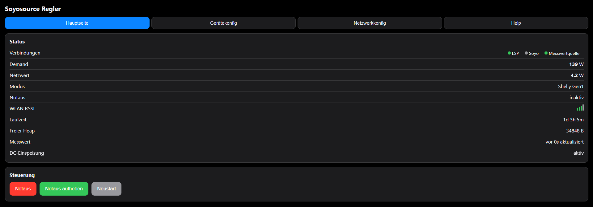
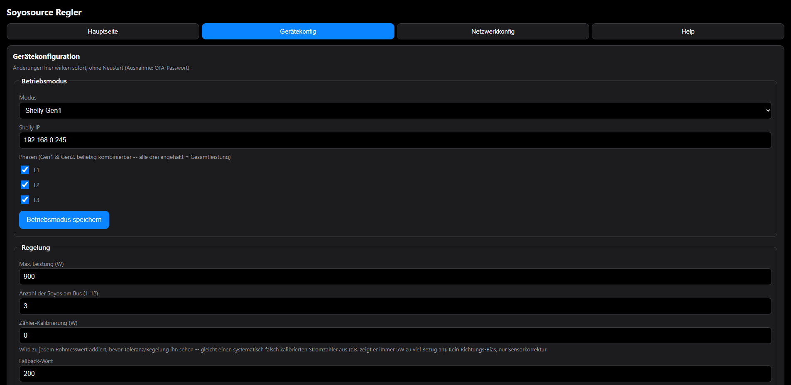
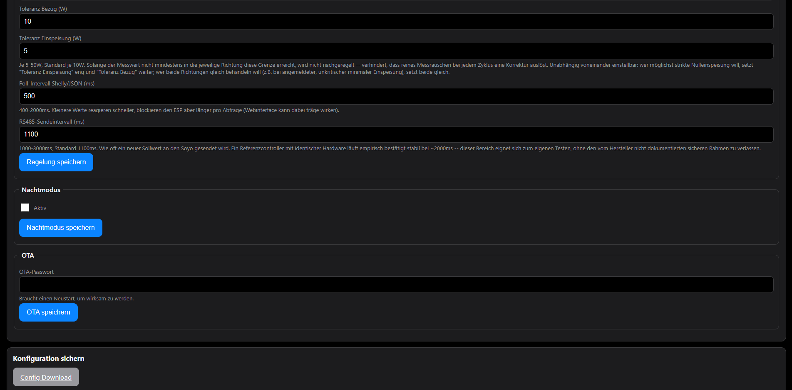

# Soyosource GTN1000/1200 Nulleinspeisungsregler

ESP8266 (NodeMCU v2) Firmware für einen Soyosource GTN1000/1200 Nulleinspeisungsregler.
Inspiriert von [BavarianSuperGuy/Esp-Soyosource-Controller](https://github.com/KlausLi/Esp-Soyosource-Controller).

## Sicherheitshinweis

Dieses Projekt ist ein privates Hobby-Projekt, kein zertifiziertes Produkt. Es
greift in die Regelung eines netzgekoppelten Wechselrichters ein — Fehler in
Konfiguration, Verkabelung oder Firmware können zu unerwünschter
Netzeinspeisung oder Sachschäden führen. Es gelten die Vorgaben deines
Netzbetreibers/EVU zur Nulleinspeisung — das musst du selbst prüfen, bevor du
das Gerät produktiv einsetzt.

Aktueller Stand: getestet an genau einem Aufbau, seit dem 17.07.2026 in
Entwicklung/Testbetrieb — kein langjähriger Dauerbetrieb, keine Tests an anderer Hardware
oder anderen Soyo-Firmware-Ständen. Live gemessen: RS485-Sendezyklus im
Schnitt 1100,8ms bei konfigurierten 1100ms (Jitter ±30-40ms),
Shelly-Poll-Antwortzeit 80-250ms bei 500ms-Intervall — daraus ergibt sich eine
Latenz von Netzänderung bis RS485-Sollwert von grob bis zu ~1,6s im Worst
Case. Keine Garantie, keine Haftung (siehe [LICENSE](LICENSE)) — Nutzung auf
eigene Verantwortung.

## Über dieses Projekt

Dieses Projekt ist eine eigenständige, vollständig neu geschriebene Firmware für den Soyosource GTN1000/1200, angeregt durch die Arbeit von
[BavarianSuperGuy (KlausLi)](https://github.com/KlausLi/Esp-Soyosource-Controller),
der mit seinem Esp-Soyosource-Controller die Idee eines ESP8266-basierten
Nulleinspeisungsreglers für dieses Wechselrichtermodell bekannt gemacht hat.

Eigenschaften dieser Firmware:

- **Non-blocking WiFi**: WLAN-Verbindungsaufbau und Reconnect laufen non-blocking
  über eine Zustandsmaschine, ohne den restlichen Betrieb zu blockieren.

- **Fallback-WLAN**: optionales zweites Netz (z.B. Handy-Hotspot), das erst
  probiert wird, wenn das primäre WLAN eine Weile nicht erreichbar ist.
  Primäres WLAN bleibt bevorzugt — läuft das Gerät auf dem Fallback, wird
  im Hintergrund regelmäßig geprüft, ob das primäre Netz wieder da ist, und
  automatisch zurückgewechselt.

- **Werksreset**: GPIO0 5 Sekunden beim Boot gedrückt halten (siehe Abschnitt
  "Werksreset" unten).

- **Vollständig quelloffen**: Jede Zeile Code einsehbar, anpassbar, verbesserbar.

- **Non-blocking HTTP**: Shelly-/JSON-Polling läuft über `asyncHTTPrequest`
  (auf `ESPAsyncTCP`), blockiert `loop()` also nicht mehr wie ein klassischer
  `HTTPClient`-Aufruf — Webserver und RS485-Senden laufen währenddessen
  ungestört weiter.

- **Fallback-Logik**: Bei Shelly-Ausfall konfigurierbarer Fallback-Watt
  mit definiertem Verhalten und LED-Anzeige.

- **Telnet-Logging**: Echtzeit-Diagnose ohne seriellen Adapter (Port 23).

- **Optionales Display**: SSD1306-OLED (I²C), drei automatisch wechselnde
  Screens (Config-Portal während der Ersteinrichtung, kurzer Boot-Splash,
  dauerhafter Betriebsscreen mit Netz-/Soyo-Leistung, WLAN-Status und
  aktivem Modus) — live-Status ohne Handy/Laptop (siehe Abschnitt "Display"
  unten).

- **HA Auto-Discovery**: Automatische Integration in Home Assistant per MQTT.

- **Nachtmodus**: Leistungsbegrenzung per Uhrzeit (NTP-basiert).

- **Config-Backup/Restore**: Konfiguration als JSON exportieren und importieren.

## Hardware

| Funktion         | GPIO        | Modul-Pin (Aufdruck) |
|------------------|-------------|----------------------|
| RS485 TX         | GPIO1 (TX0) | DI (Data In)         |
| RS485 RX         | GPIO3 (RX0) | RO (Receiver Output) |
| RS485 DE         | GPIO14 (D5) | DE                   |
| RS485 RE (optional, siehe unten) | GPIO12 (D6) | RE |
| Flash-Button     | GPIO0 (Werksreset: 5s beim Boot gedrückt halten) | — |
| LED (onboard)    | GPIO2, active LOW | — |
| Display SDA      | GPIO4 (D2) | SDA |
| Display SCL      | GPIO5 (D1) | SCL |

Modul-Pins `VCC`/`GND`: 3.3V/GND vom ESP. Modul-Pins `A`/`B`: RS485-Bus zum
Soyosource-Wechselrichter (nicht mit dem ESP verbunden, nur mit dessen RS485-
Anschluss).

**Achtung Pin-Beschriftung:** Die GPIO-Nummer im Code (`4`/`5`) und das
"D"-Label auf dem NodeMCU-Silkscreen sind nicht dasselbe — GPIO4 ist auf der
Platine mit "D2" beschriftet, GPIO5 mit "D1". Die Zuordnung ist historisch
gewachsen, nicht durchnummeriert (D1=GPIO5, D2=GPIO4, D3=GPIO0, D4=GPIO2, ...).

**DE/RE-Verkabelung, zwei Varianten:**
1. **DE und RE auf dem Modul verlötet/gebrückt** (klassisch): nur eine Leitung
   zum ESP nötig, an GPIO14/D5. GPIO12/D6 bleibt unbenutzt.
2. **DE und RE getrennt, ohne Löten am Modul**: DE → GPIO14/D5, RE → GPIO12/D6
   (benachbarter Pin). Die Firmware schreibt auf beide GPIOs ohnehin immer
   denselben Pegel (DE ist active HIGH, RE ist active LOW, beide brauchen in
   Sende- wie Empfangsrichtung zufällig denselben Wert — siehe [rs485.h](src/rs485.h)),
   daher funktioniert diese Variante ohne jede Softwareänderung.

RS485-Modul TX/RX (also DI/RO) werden an den Hardware-UART (Serial) angeschlossen,
dieser wird ausschließlich für RS485 verwendet — kein Debug-Output über Serial.

## Display (optional)

Ein SSD1306-OLED (128×64, I²C) an den oben genannten Pins zeigt den
Live-Betrieb an, ohne dass ein Handy/Laptop nötig ist. Läuft mit 400kHz
I²C-Takt und aktualisiert sich im selben Rhythmus wie `poll_interval_ms`
(siehe [display.cpp](src/display.cpp)) — bewusst kein schnelleres Redraw,
da jede I²C-Übertragung `loop()` kurz blockiert und unnötig häufige Updates
so nur RS485/Regelung stören würden, ohne sichtbaren Zusatznutzen.

Drei Screens, automatischer Wechsel:

1. **Config-Portal**: solange das Gerät im AP-Setup-Modus wartet (siehe
   "Ersteinrichtung" unten), zeigt das Display dauerhaft SSID und IP des
   Setup-Access-Points — kein Zeit-basierter Wechsel, bleibt bis die
   WLAN-Zugangsdaten gespeichert wurden.
2. **Splash**: nach Verlassen des Config-Portals kurz das Wordmark samt
   Firmware-Version, dann — sobald das WLAN verbunden ist — für 5 Sekunden
   die zugewiesene IP-Adresse.
3. **Betrieb** (dauerhaft danach): WLAN-Status und aktiver Modus
   (AUTO/NIGHT/FALLBACK/NOTAUS) in der Statuszeile, darunter groß die
   Netz-Leistung mit Richtungspfeil (Bezug/Einspeisung) sowie die
   Soyo-Gesamtleistung (`g_demand * soyo_count`, siehe "Betriebsmodi" unten
   zu `soyo_count`).

## Build & Flash

```
pio run -t upload
pio run -t uploadfs   # LittleFS-Image (nur nötig falls Dateien in data/ liegen)
```

## Ersteinrichtung

1. Erstes Boot ohne `config.json` (oder leere `wifi_ssid`) → Gerät startet einen
   Access Point `SOYO-Setup` (Passwort `1234567890`, IP `10.0.0.1`). Captive
   Portal öffnet sich auf den meisten Smartphones automatisch.
2. Im Webinterface unter "Netzwerkkonfiguration" → WLAN die Zugangsdaten setzen,
   "WLAN speichern" klicken → Gerät speichert und startet neu, verbindet sich mit dem WLAN.
   Optional zusätzlich eine Fallback-SSID/Passwort eintragen (siehe oben).
3. Danach erreichbar über `http://soyo.local` oder die vom Router vergebene IP.
   Unter "Gerätekonfiguration" → Betriebsmodus den gewünschten Modus einstellen
   und "Betriebsmodus speichern" klicken.

## Webinterface

Drei Tabs, umschaltbar ohne Neuladen der Seite:

- **Hauptseite**: Live-Status (Demand, Netzwert, Modus, Notaus, RSSI, Laufzeit,
  Heap, Soyo-RS485-Werte falls verfügbar) sowie die Notaus-/Neustart-Buttons.
  Oben drei Statuspunkte: **ESP** (grün, solange `/status` antwortet), **Soyo**
  (grün nur bei tatsächlicher RS485-Antwort — bleibt bei Geräten ohne
  Status-Antwort dauerhaft aus, das ist kein Fehler, siehe Abschnitt "RS485
  Status-Response"), **Messwertquelle** (nur bei Shelly/JSON-Modus sichtbar,
  rot bei aktivem Fallback).
- **Gerätekonfiguration**: Betriebsmodus, Regelung, Nachtmodus, OTA, Config-
  Download/-Upload.
- **Netzwerkkonfiguration**: WLAN, MQTT.







## Webinterface: Einzelspeicherung pro Bereich

Es gibt keinen globalen "Alles speichern"-Button mehr. Jeder Konfigurationsblock
(WLAN, MQTT, Betriebsmodus, Regelung, Nachtmodus, OTA) hat einen eigenen
Save-Button und wird unabhängig von den anderen gespeichert — Felder, die
nicht mitgeschickt werden, bleiben unverändert (siehe `configMergeFromJsonString`
in [storage.cpp](src/storage.cpp)).

- **Netzwerkkonfiguration** (WLAN, MQTT): braucht nach dem Speichern einen
  Neustart, da WLAN-Verbindung bzw. MQTT-Broker-Verbindung nur einmal beim
  Boot aufgebaut werden.
- **Gerätekonfiguration** (Betriebsmodus, Regelung, Nachtmodus): wirkt sofort,
  ohne Neustart — diese Werte werden von der jeweiligen Regel-/Poll-Schleife
  bei jedem Durchlauf frisch aus der Konfiguration gelesen.
- **OTA-Passwort**: Ausnahme innerhalb der Gerätekonfiguration, braucht
  ebenfalls einen Neustart (ElegantOTA wird nur einmal beim Boot initialisiert).

Der Server entscheidet selbst anhand der im Request enthaltenen Felder, ob ein
Neustart nötig ist — nicht das Frontend. `Config Upload` (Wiederherstellung aus
einer heruntergeladenen Backup-Datei) startet dagegen immer neu, unabhängig
vom Inhalt.

## Werksreset

GPIO0 (Flash-Taste) beim Einschalten 5 Sekunden gedrückt halten → LittleFS wird
formatiert, Gerät startet neu und geht wieder in den AP-Setup-Modus.

## Betriebsmodi

- **Static**: Ausgang konstant auf `static_watt` (kein externer Messwert nötig).
  `static_watt` und `fallback_watt` meinen die Summe über alle angeschlossenen
  Soyos (`soyo_count`) — die Firmware teilt den Wert selbst passend durch
  `soyo_count`, bevor er als Sollwert pro Gerät gesendet wird. `max_power` und
  `night_max_power` sind dagegen bewusst **pro Inverter** gemeint (z.B. dessen
  Typenschild-Maximalwert) und werden direkt als Pro-Gerät-Obergrenze
  verwendet — bei ungleich starken Invertern am selben Bus einfach den Wert
  der stärksten Geräte eintragen, ein schwächeres Gerät begrenzt sich selbst.
  **Wichtig:** diese Selbstbegrenzung funktioniert nur, wenn der jeweilige
  Maximalwert auch tatsächlich korrekt in der eigenen Firmware/Konfiguration
  des Inverters hinterlegt ist (Soyo-eigenes Konfigurationstool, unabhängig
  von diesem ESP8266-Controller) — vor dem Mischen unterschiedlich starker
  Geräte am selben Bus bei jedem einzelnen Inverter prüfen.
- **HttpInterface**: externe Quelle pusht Messwert per `GET /L1L2L3Auto?Value=<watt>`.
- **MqttSub**: Messwert kommt per MQTT-Subscribe auf `mqtt_sub_topic`.
- **Shelly Gen1 / Gen2 Pro**: Firmware pollt den Shelly per HTTP, Intervall
  einstellbar (`poll_interval_ms`, 400-2000ms, Standard 500ms; Feld "Poll-
  Intervall Shelly/JSON" im Webinterface). Der RS485-Sendezyklus läuft davon
  unabhängig über ein eigenes Intervall (`rs485_send_interval_ms`,
  1000-3000ms, Standard 1100ms). Phasen L1/L2/L3 frei kombinierbar über drei
  unabhängige Checkboxen im Webinterface (Standard: alle drei angehakt =
  Gesamtleistung; genauso z.B. nur L1+L2 möglich) — bei beiden Generationen
  gleich, Gen1 liefert die Einzelphasen über das `emeters`-Array seiner
  `/status`-Antwort, Gen2 über `a_act_power`/`b_act_power`/`c_act_power`.
  Ein einzelner HTTP-Request liefert dabei immer alle drei Phasen auf einmal,
  unabhängig von der Auswahl.
- **JSON HTTP Client**: generischer Poll gegen eine beliebige JSON-URL mit
  Punkt-separiertem Pfad (z.B. `StatusSNS.SML.DJ_TPWRCURR`), gleiches
  einstellbares Poll-Intervall wie bei Shelly.

Bei den pollenden Modi (Shelly/JSON) schaltet die Firmware nach 3 Fehlversuchen in
einen Fallback-Zustand (`fallback_watt`) und kehrt nach 3 erfolgreichen Antworten
wieder in den Normalbetrieb zurück.

**Bedeutung des Messwerts ("Netzwert"):** die aktuell vom Stromzähler gemessene
Abweichung vom Nullpunkt (Netto-Null-Einspeisung), nicht der absolute
Hausverbrauch. **Positiv** = das Haus bezieht gerade zusätzlich Strom aus dem
Netz, Soyo muss die Einspeisung erhöhen. **Negativ** = überschüssiger Strom
fließt ins Netz zurück, Soyo muss verringern. Diese Abweichung fließt direkt in
die Sollwert-Nachführung ein (`target = aktueller Sollwert + Netzwert /
soyo_count`) — im eingeschwungenen Zustand pendelt der Wert nahe 0 (innerhalb
des Toleranzbands). Am Display wird nur der Betrag angezeigt, die Richtung
steckt in einem separaten Pfeilsymbol (siehe "Display" oben).

## RS485 Status-Response

Das Sende-Frame (Sollwert setzen) und die Status-Anfrage sind exakt nach Vorgabe
implementiert (8 Byte, 4800 8N1, Checksumme `(264 - byte[4] - byte[5]) & 0xFF`).

Die **Antwort** des Wechselrichters ist ein 15-Byte-Frame:

```
[0]      0x23 Header
[1]      0x01
[2]      0x01
[3]      0x00 Reserved
[4]      Operation-Status (0=Normal, 1=Startup, 2=Standby, 3=Startup aborted, 4=Error/Battery)
[5..6]   Batteriespannung, uint16 BE, x0.1V
[7..8]   Batteriestrom,    uint16 BE, x0.1A
[9..10]  AC-Spannung,      uint16 BE, x1V
[11]     AC-Frequenz,      uint8,     x0.5Hz
[12..13] Temperatur,       uint16 BE, (raw-300) x0.1°C
[14]     CRC (Algorithmus nicht bekannt, wird nicht geprüft)
```

Vor dem Parsen validiert [rs485.cpp](src/rs485.cpp): Frame ist exakt 15 Byte,
Byte 0 ist `0x23`, und Batteriespannung/AC-Spannung/Temperatur liegen unter den
Sanity-Grenzen (150V / 300V / 200°C) — sonst wird der Frame verworfen und
geloggt.

**Neuere Geräte (purple mainboard, Firmware STC8-2022-218) antworten grundsätzlich
nicht auf den Status-Request.** Das ist kein Fehler: `g_soyoStatus.valid` bleibt
einfach `false` und die "Soyo-Status"-Karte im Webinterface bleibt ausgeblendet.

## Telnet-Log

`telnet soyo.local` (Port 23) zeigt WiFi-Statuswechsel, RS485-Frames (Hex),
HTTP-/MQTT-Fehler, Demand-Änderungen, Fallback-Start/Ende und Heap-Stand live an.
Die letzten 20 Zeilen sind zusätzlich über `GET /log` als JSON abrufbar.

## OTA

`http://soyo.local/update`, abgesichert mit dem in der Konfiguration gesetzten
OTA-Passwort (Feld "OTA-Passwort", Nutzername leer). Während des Uploads wird
Notaus gesetzt, RS485 pausiert und kein neuer Shelly-/JSON-Poll mehr gestartet
(`g_otaActive`, siehe ota.cpp/shelly.cpp) — der ESP8266 braucht seinen Speicher
und seine Rechenzeit dann fürs Flash-Schreiben. Nach Abschluss des Uploads
startet das Gerät automatisch neu, unabhängig davon ob der Upload erfolgreich
war oder nicht (`onOTAEnd()`, siehe ota.cpp) — bei Erfolg bootet die neue
Firmware, bei Fehlschlag einfach wieder die alte. Kommt trotz gestartetem
Update-Vorgang nie ein Upload an (z.B. abgebrochene Verbindung), hebt die
Firmware Notaus/RS485-Pause nach 2 Minuten von selbst wieder auf, ganz ohne
Neustart (`OTA_TIMEOUT_MS`).

Alternativ direkt per Kommandozeile (z.B. wenn kein USB-Port mehr frei ist):

```
curl http://soyo.local/ota/start
curl -F "firmware=@.pio/build/nodemcuv2/firmware.bin" http://soyo.local/ota/upload
```

## Für Einsteiger: wiederkehrende Code-Muster

Der Code ist kommentiert, aber ein paar Muster tauchen in fast jeder Datei auf.
Wer sie einmal verstanden hat, kann den restlichen Kommentaren im Code leichter folgen.

- **`static` vor einer Funktion/Variable** bedeutet: nur in dieser einen `.cpp`-Datei
  sichtbar, sonst nirgendwo im Projekt. Das ist Absicht, kein Tippfehler — es
  verhindert, dass sich z.B. zwei `lastSendMillis` aus unterschiedlichen Dateien
  in die Quere kommen.
- **`extern`** in einer `.h`-Datei ist das Gegenteil: "diese Variable/Funktion gibt
  es, ihre eigentliche Definition steht in einer `.cpp`-Datei". So teilen sich z.B.
  `main.cpp` und `http_server.cpp` denselben `config`. Suche nach der Zeile ohne
  `extern` (meist ganz oben in der passenden `.cpp`), um die echte Definition zu finden.
- **Kein `delay()`, stattdessen `millis()`-Zeitstempel**: Ein `delay(1000)` würde den
  ESP8266 eine ganze Sekunde lang komplett blockieren — kein WLAN, kein Webserver,
  nichts. Stattdessen merkt sich der Code den Zeitpunkt der letzten Aktion
  (`lastXyzMillis = millis();`) und prüft bei jedem Schleifendurchlauf nur, ob
  genug Zeit vergangen ist (`if (millis() - lastXyzMillis >= INTERVAL) { ... }`).
  So kann `loop()` nebenbei weiter WLAN, Webserver usw. bedienen. Das ist das
  wichtigste Muster im ganzen Projekt und taucht in praktisch jeder Datei auf.
- **`struct Config` und `enum OperatingMode`**: Ein `struct` ist einfach ein Behälter
  für mehrere zusammengehörige Werte (hier: alle Einstellungen). Ein `enum` gibt
  Zahlen sprechende Namen — `MODE_STATIC` ist nur ein anderer Name für `0`, aber
  deutlich lesbarer als eine nackte `0` im Code.
- **Callback-Funktionen** (z.B. `mqttCallback`, `onOTAStart`): Diese Funktionen ruft
  man nicht selbst auf. Man "registriert" sie einmal bei einer Bibliothek
  (`setCallback(mqttCallback)`), und die Bibliothek ruft sie automatisch auf, sobald
  das jeweilige Ereignis eintritt (z.B. eine MQTT-Nachricht kommt an).
- **`JsonDocument doc; doc["key"] = wert;`**: Das ist die ArduinoJson-Bibliothek
  (Version 7). `doc` ist ein JSON-Objekt im Speicher, das seine Größe bei Bedarf
  automatisch anpasst -- anders als in älteren ArduinoJson-Versionen muss man
  keine feste Maximalgröße mehr angeben. `serializeJson(doc, ziel)` wandelt es
  in echten JSON-Text um, `deserializeJson(doc, text)` liest JSON-Text wieder
  in `doc` ein.
- **Zwei Zahlen zu einer größeren zusammensetzen** (`(frame[5] << 8) | frame[6]`):
  RS485/MQTT/JSON übertragen oft 16-Bit-Zahlen als zwei einzelne Bytes. `<< 8`
  schiebt das erste Byte um 8 Bit nach links (macht daraus quasi die "Zehnerstelle"),
  `|` fügt das zweite Byte als "Einerstelle" dazu. Beispiel: Bytes `0x01, 0x2C`
  ergeben `0x012C` = 300.
- **Warum `shellyLoop()` `request.readyState()` pollt statt einen
  `onReadyStateChange`-Callback zu nutzen** (asyncHTTPrequest-Bibliothek,
  siehe shelly.cpp): Async-TCP-Callbacks auf dem ESP8266 laufen auf einem
  deutlich kleineren Stack als der normale `loop()`. Arbeit, die viel Stack
  braucht (allen voran `deserializeJson()` mit seinem rekursiven Abstieg durch
  das JSON), kann dort einen Stack-Overflow und damit einen harten Absturz/
  Reset auslösen -- unabhängig vom eigentlich freien Heap. Deshalb wird hier
  bewusst KEIN `onReadyStateChange`-Callback registriert; `shellyLoop()`
  fragt `readyState()` stattdessen bei jedem normalen Schleifendurchlauf ab
  und wertet die Antwort (inkl. `deserializeJson()`) erst dort aus -- auf dem
  normalen, ausreichend großen `loop()`-Stack.

## Lizenz

MIT License — siehe [LICENSE](LICENSE).

Protokoll-Informationen (RS485-Frame-Format) basieren auf Community-Reverse-Engineering,
dokumentiert unter:
- https://github.com/syssi/esphome-soyosource-gtn-virtual-meter
- https://secondlifestorage.com/index.php?threads/limiter-inverter-with-rs485-load-setting.7631/
